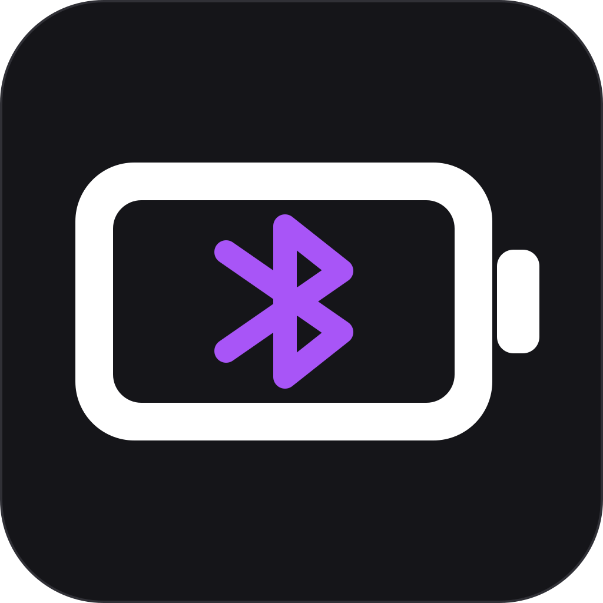
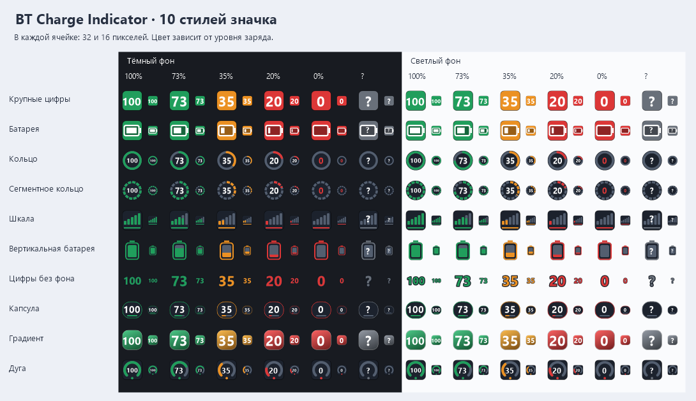

<p align="center">
  
</p>

# Bluetooth Battery Indicator for Windows

[](https://github.com/L1GHTSHAPER/BT-Charge-Indicator)
[](https://dotnet.microsoft.com/)
[](https://github.com/L1GHTSHAPER/BT-Charge-Indicator/releases/latest)
[](LICENSE)

**BT Charge Indicator** is a lightweight Windows system tray app that displays the battery percentage of connected Bluetooth devices: wireless headphones, earbuds, headsets, game controllers, keyboards, mice, speakers, and other accessories.

It works natively on Windows 10 and Windows 11 and reads battery levels through Windows device properties, Bluetooth HFP/PnP data, and the standard Bluetooth Low Energy GATT Battery Service.

## Download

Download the latest ready-to-run Windows executable from [GitHub Releases](https://github.com/L1GHTSHAPER/BT-Charge-Indicator/releases/latest). The app is portable and does not require installation.

## Features

- large, readable battery percentage directly in the Windows notification area;
- ten tray icon styles: large numbers, battery, ring, segmented ring, bars, vertical battery, minimal numbers, capsule, gradient, and gauge;
- all paired Bluetooth devices in one tray menu;
- support for Bluetooth Classic and Bluetooth Low Energy (BLE) devices;
- HFP/PnP battery reading for wireless headphones and earbuds;
- BLE GATT Battery Service fallback;
- Apple AirPods battery reading from Continuity Bluetooth LE advertisements, including separate left, right, and case levels;
- separate left, right, and case levels for Nothing and CMF earbuds, including CMF Buds Pro 2;
- Google Fast Pair battery advertisements for compatible TWS earbuds from other manufacturers;
- multiple-instance BLE GATT Battery Service support when component labels are exposed;
- Sony PlayStation DualSense and DualSense Edge battery reading over Bluetooth HID;
- automatic refresh every 30 seconds, 1 minute, or 5 minutes;
- configurable low battery threshold and native Windows notifications with snooze;
- per-device renaming, hiding, tray icon inclusion, and notification settings;
- device diagnostics showing the battery data source and Bluetooth identifiers;
- optional startup with Windows;
- optional automatic update checks through GitHub Releases;
- quick access to Windows Bluetooth settings;
- native C# WinForms app with no web browser or background server;
- no telemetry or accounts.

## Supported devices

BT Charge Indicator can display battery information for devices that report their charge to Windows, including many:

- Bluetooth headphones, headsets, and TWS earbuds;
- Xbox and other Bluetooth game controllers;
- Sony PlayStation DualSense and DualSense Edge controllers;
- wireless mice and keyboards;
- portable speakers;
- BLE accessories that implement the standard Battery Service.

Battery reporting depends on the device firmware and Windows driver. Separate TWS component levels are available through Apple Continuity, Nothing/CMF RFCOMM, Google Fast Pair, or labeled multiple-instance GATT services. Accessories that use another proprietary battery protocol may still expose only one combined percentage or appear with `—`.

## Usage

1. Download and run `BTChargeIndicator.exe`.
2. Find the colored percentage icon in the Windows system tray.
3. Left-click the icon for a quick battery summary.
4. Right-click it for the full device list and settings.
5. Double-click it to open Windows Bluetooth settings.

The tray icon shows the lowest known battery percentage among currently connected devices, helping you notice the accessory that needs charging first.
Choose a style from **«Вид значка в трее»** in the right-click menu. The selection is saved automatically; every style indicates low charge in red, medium charge in amber, and unavailable readings with a question mark.



On first run, the app creates a Start menu shortcut for itself so Windows can display native notifications. Moving the portable executable is supported; the shortcut is refreshed on the next launch.

## Build from source

Requirements:

- Windows 10 or Windows 11;
- [.NET 9 SDK](https://dotnet.microsoft.com/download/dotnet/9.0).

Create a self-contained single-file build:

```powershell
.\build.ps1
```

The executable will be created at `dist\BTChargeIndicator.exe`.

Create a smaller framework-dependent build:

```powershell
.\build.ps1 -Portable
```

## How battery detection works

The app combines several Windows APIs because different Bluetooth accessories expose their charge differently:

1. `System.Devices.BatteryLife` for standard Windows device battery data;
2. the Windows HFP/PnP battery property used by many Bluetooth headsets and earbuds;
3. the Bluetooth LE GATT Battery Service, including labeled multiple battery instances;
4. Apple Continuity Bluetooth LE advertisements for AirPods;
5. Google Fast Pair battery advertisements for compatible TWS earbuds;
6. the Nothing/CMF RFCOMM companion protocol for separate earbud and case levels;
7. Sony DualSense Bluetooth HID input reports for PlayStation controllers.

This approach supports more devices than relying on a single Bluetooth API.

The Fast Pair battery layout follows the official [Google Fast Pair Battery Notification specification](https://developers.google.com/nearby/fast-pair/specifications/extensions/batterynotification). The Nothing/CMF adapter is compatible with the reverse-engineered protocol documented by the open-source [Something X](https://github.com/SoaOaoS/something-x) project.

## Русский

**BT Charge Indicator** — приложение для отображения заряда Bluetooth-устройств в системном трее Windows 10/11. Поддерживаются беспроводные наушники, TWS-гарнитуры, геймпады, мыши, клавиатуры, колонки и BLE-аксессуары.

Скачайте готовый файл на странице [последнего релиза](https://github.com/L1GHTSHAPER/BT-Charge-Indicator/releases/latest), запустите его и откройте меню правым щелчком по значку в трее. Установка не требуется.

## Privacy

BT Charge Indicator processes Bluetooth device data locally and does not collect analytics or send device information. When automatic update checks are enabled, it contacts only the public GitHub Releases API for this repository; the option can be disabled from the tray menu.

## Contributing

Bug reports and pull requests are welcome. When reporting a device that does not show its battery, include the Windows version, device model, connection state, and whether Windows Settings displays a percentage.

## License

Distributed under the [MIT License](LICENSE).

<p>
  
</p>

---

Keywords: Windows Bluetooth battery monitor, Bluetooth battery level, Bluetooth headphones battery, earbuds battery percentage, BLE battery indicator, Windows 11 system tray battery app, Bluetooth device charge monitor, C# WinForms Bluetooth.
